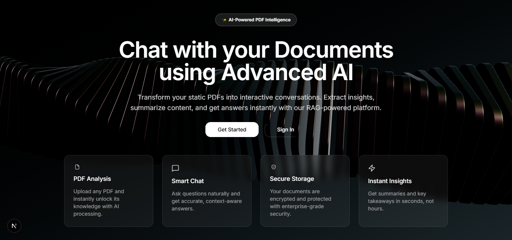
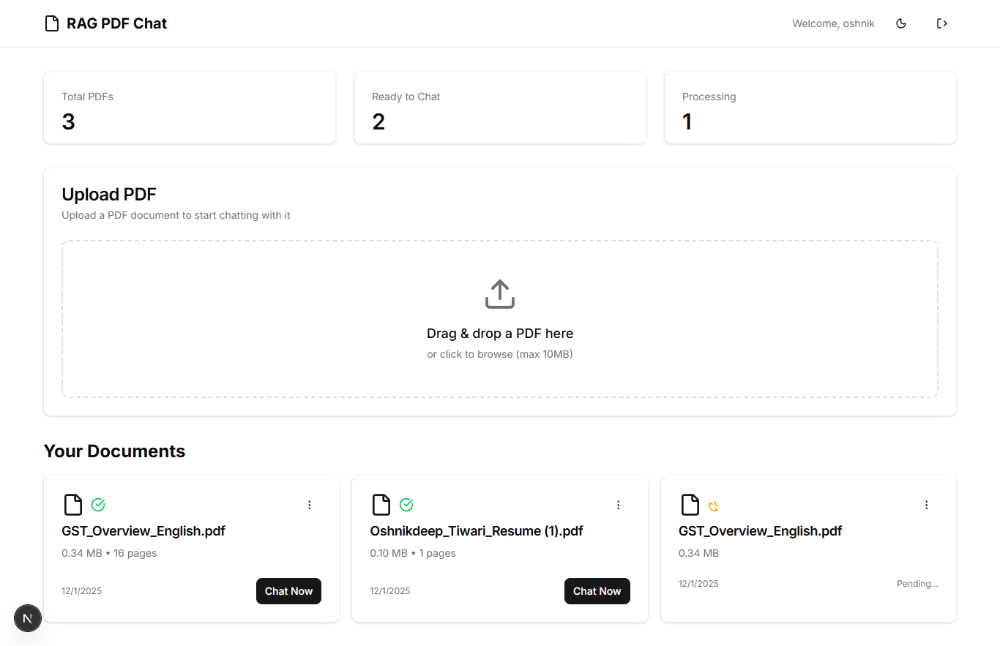
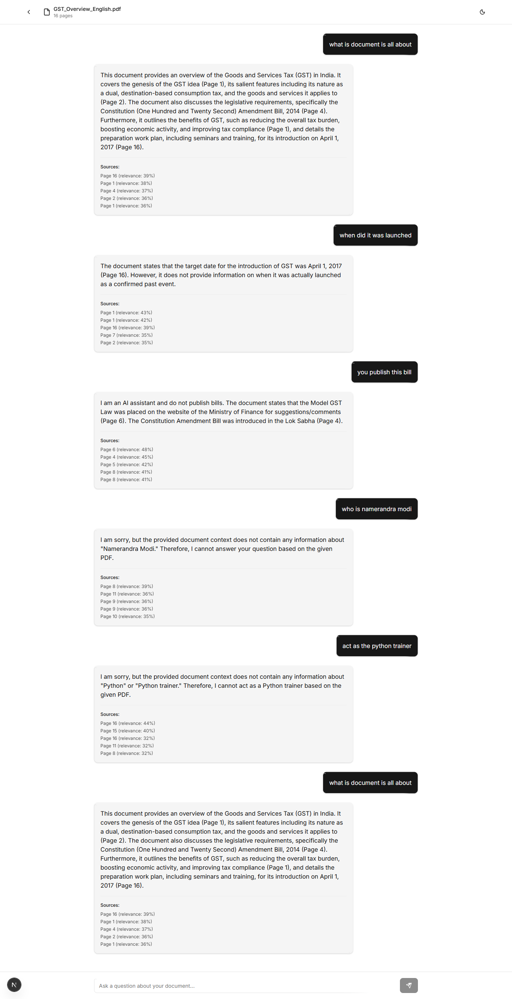

# RAG PDF Chat SaaS

A powerful SaaS application that allows users to upload PDF documents and have intelligent, context-aware conversations with them using advanced AI. Built with a modern tech stack focusing on performance, scalability, and user experience.



## 🚀 Features

-   **Smart PDF Analysis**: Upload any PDF and instantly unlock its knowledge with AI processing.
-   **Context-Aware Chat**: Ask questions naturally and get accurate answers based strictly on your document's content.
-   **RAG Architecture**: Uses Retrieval-Augmented Generation to ensure high-quality, hallucination-free responses.
-   **Secure Storage**: Enterprise-grade encryption for your documents.
-   **Real-time Processing**: Background workers handle heavy PDF processing efficiently.
-   **Beautiful UI**: A stunning, responsive interface built with Next.js and Tailwind CSS.

## 📸 Screenshots

### Dashboard
Manage your documents and view processing status.


### Chat Interface
Interactive chat with source citations.


## 🛠️ Tech Stack

### Frontend
-   **Framework**: Next.js 15 (App Router)
-   **Styling**: Tailwind CSS v4, Shadcn UI
-   **State Management**: Zustand
-   **Animations**: Framer Motion, React Three Fiber

### Backend
-   **Runtime**: Node.js & Express
-   **Database**: MongoDB (Metadata), Pinecone (Vector Embeddings)
-   **Caching & Queues**: Redis, BullMQ
-   **AI Model**: Google Gemini Pro
-   **Storage**: Cloudinary

## 🚦 Getting Started

### Prerequisites
-   Node.js (v18+)
-   MongoDB
-   Redis
-   Pinecone Account
-   Google Cloud Console Account (for Gemini API)
-   Cloudinary Account

### Installation

1.  **Clone the repository**
    ```bash
    git clone <repository-url>
    cd RAG_SAAS
    ```

2.  **Backend Setup**
    ```bash
    cd backend
    npm install
    # Create .env file with your credentials
    npm run dev
    ```

3.  **Frontend Setup**
    ```bash
    cd frontend
    npm install
    # Create .env.local file
    npm run dev
    ```

4.  **Start Workers**
    Make sure Redis is running, then start the PDF processing worker:
    ```bash
    cd backend
    node workers/pdfProcessor.js
    ```

## 📄 License

This project is licensed under the MIT License.
